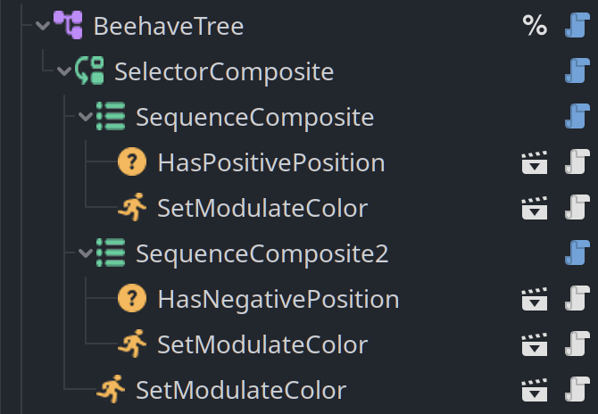
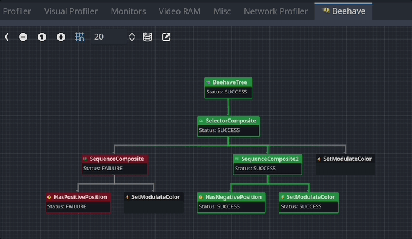
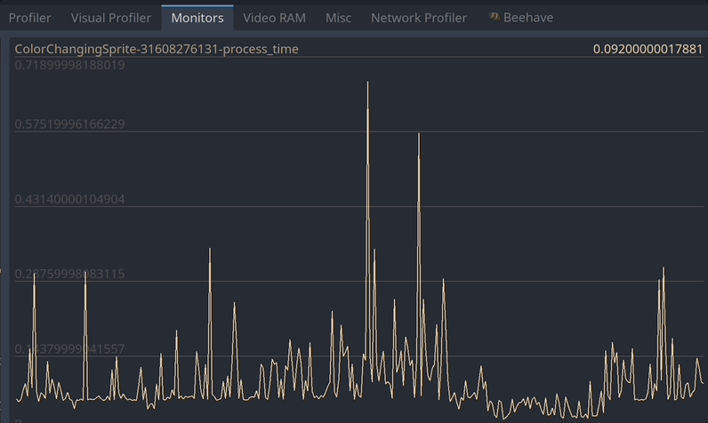
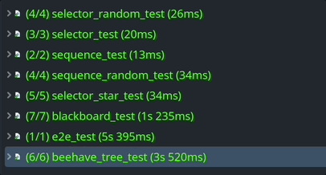
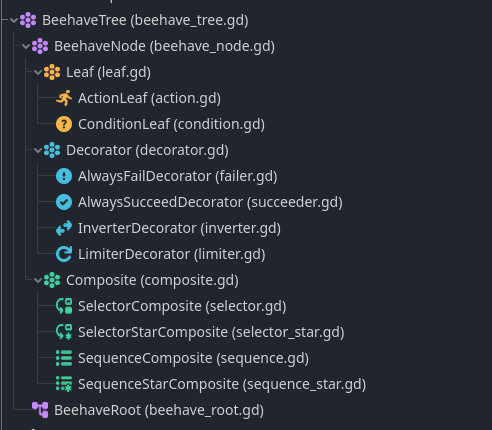

  

---

**[Beehave](https://bitbra.in/beehave) is a powerful addon for Godot Engine that enables you to create robust AI systems using behavior trees.** With Beehave, you can easily design complex NPC behaviors, build challenging boss battles, and create other advanced setups with ease.

Using behavior trees, Beehave makes it simple to create highly adaptive AI that responds to changes in the game world and overcomes unexpected obstacles. Whether you are a beginner or an experienced developer, Beehave is the perfect tool to take your game AI to the next level.

# 🐝 Features

### 🤖 Node based - build behavior trees within your scene tree

Compose behavior trees in your scene and attach them to any node of your chosing.

### 🐛 Debug view - a dedicated debug view to analyze your behavior at runtime

A dedicated debug view inside the Godot editor allows you to better understand what the behavior is doing under the hood.

### 🚗 Performance - built-in monitors to track performance of your behavior trees

Maintaining high framerate is important in games. Investigate performance issues by using the custom monitor available inside the Godot editor.

### 🧪 Tested - any functionality of this addon is covered by test automation

In order to avoid bugs creeping into the codebase, every feature is covered by unit tests.

# 🧪 Installation

1. [Download for Godot 3.x](https://github.com/bitbrain/beehave/archive/refs/heads/godot-3.x.zip) or [Download for Godot 4.x](https://github.com/bitbrain/beehave/archive/refs/heads/godot-4.x.zip)
2. Unpack the `beehave` folder into your `/addons` folder within the Godot project
3. Enable this addon within the Godot settings: `Project > Project Settings > Plugins`

# 📚 Getting started

Behavior trees are a modular way to build AI logic for your game. For simple AI, behavior trees are definitely overkill, however, for more complex AI interactions, behavior trees can help you to better manage changes and re-use logic across all NPCs.

[Learn how to beehave on the official wiki!](https://bitbra.in/beehave/#/manual/)

## Tutorial (Godot 3.5+)

[bitbrain](https://youtube.com/@bitbraindev) recorded this tutorial to show in more depth how to use this addon:

# 🥰 Credits

- logo designs by [@NathanHoad](https://twitter.com/nathanhoad) & [@StuartDeVille](https://twitter.com/StuartDeVille)
- original addon by [@viniciusgerevini](https://github.com/viniciusgerevini)
- icon design by [@lostptr](https://github.com/lostptr)
