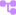
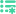

🐝  Behaviour Tree addon for [Godot Engine](https://godotengine.org/).

---

  [](https://discord.com/invite/CKBuE5djXe) [](https://shop.bitbra.in)

> ⚠ **Disclaimer: Godot 4 is not released yet. As a result, the version for Godot 4 may be unstable to use and the API may change. Please keep using [the stable 3.x branch](https://github.com/bitbrain/beehave/tree/godot-3.x) if you do not want to have breaking changes in your game.**

# 🤔 Yet another Behavior Tree addon?

There are already various behavior tree addons for Godot on the asset store, however, for my personal game none of them either worked correctly or they were UI only. I stumbled upon this amazing minimal [behaviour tree example](https://github.com/viniciusgerevini/godot-behavior-tree-example) by [@viniciusgerevini](https://github.com/viniciusgerevini). I decided to fork it and create this addon from it for the following reasons:

- dedicated repo for the addon including Godot 3.x and 4.x support
- additional features such as a debug view in editor (see [#1](https://github.com/bitbrain/beehave/issues/1))
- [I am building an RPG](https://www.youtube.com/watch?v=iU-nx2tLVnk) and will have to heavily extend this addon to my needs

If you are looking for a simplistic addon without any extra fluff, Beehave is just right for you!

# 🧪 Installation

1. [Download for Godot 3.x](https://github.com/bitbrain/beehave/archive/refs/heads/godot-3.x.zip) or [Download for Godot 4.x](https://github.com/bitbrain/beehave/archive/refs/heads/godot-4.x.zip)
2. Unpack the `beehave` folder into your `/addons` folder within the Godot project
3. Enable this addon within the Godot settings: `Project > Project Settings > Plugins`

# 📚 Getting started

Behaviour trees are a modular way to build AI logic for your game. For simple AI, behaviour trees are definitely overkill, however, for more complex AI interactions, behaviour trees can help you to better manage changes and re-use logic across all NPCs.


## What is a behaviour tree?

In a nutshell, a behaviour tree is a Godot Node that can be added as a child to other Godot nodes within the scene tree. It will run its logic every frame tick and modify the parent node accordingly.

In more theoretical terms, a behaviour tree consists of so called **nodes** - each node can be of a different type with different purposes. Those are described further down below in more detail. Every node has a `tick(actor, blackboard)` method that can be used to execute custom logic. When the `tick` function is called, beehave expects a return status of either `SUCCESS`, `RUNNING` or `FAILURE`.

In **Beehave**, every behaviour tree is of type  `BeehaveTree`. Attach that node to any node to any other node you want to apply the behaviour tree to.

## Tutorial (Godot 3.5+)

I have recorded this tutorial to show in more depth how to use this addon:

[](https://www.youtube.com/watch?v=n0gVEA1dyPQ)

##  Actions and Conditions

Conditions are **leaf nodes** of type  `ConditionLeaf`. They should be kept simple and either return `SUCCESS` or `FAILURE` depending on a single condition. Avoid creating conditions that check multiple things as it will become more difficult to reuse these nodes.

**1. Example Condition code: IsVisibleCondition.gd**

```gdscript
class_name IsVisibleCondition extends ConditionLeaf

func tick(actor:Node, blackboard:Blackboard) -> int:
    if actor.visible:
        return SUCCESS
    return FAILURE
```

Actions are **leaf nodes** of type  `ActionLeaf`. They can be long running potentially being called across multiple frame executions. In this case return the code `RUNNING` .

**2. Example Condition code: MakeVisibleAction.gd**

```gdscript
class_name MakeVisibleAction extends ActionLeaf

func tick(actor:Node, blackboard:Blackboard) -> int:
    if actor.visible:
        return FAILURE
    actor.visible = true
    return SUCCESS
```

The  `Blackboard` is an object that can be used to store and access data between multiple nodes.

##  Composites

In order to create logic flows based on conditions and actions, we need to _compose_ them through so called **composites**. A composite is a node that executes its children in a particular manner as described below.

###  Selector

**Selector** nodes will attempt to execute each of its children and reports `SUCCESS` status code in case one of the children reports a `SUCCESS` status code. In case all children report a `FAILURE` status code, this node will also return `FAILURE` status code. This node will attempt to process all its children every single tick, even if one of them is currently `RUNNING` already.

###  Selector Star (Selector Reactive)

The **Selector Star** node is similar to the **Selector**, however, it will skip all previous child nodes that were executed prior, in case one of the children is currently in `RUNNING` state. A usecase for this is if you want to ensure that only one action is executed at a time, regardless of for long it runs.

###  Selector Random

The **Selector Random** will attempt to execute all of its children just like a **Selector Star** would, with the exception that the children will be executed in a random order.

###  Sequence

**Sequence** nodes will attempt to execute all of its children and reports `SUCCESS` status code in case all of the children report a `SUCCESS` status code. In case at least one child reports a `FAILURE` status code, this node will also return `FAILURE` status code. This node will attempt to process all its children every single tick, even if one of them is currently `RUNNING` already.

###  Sequence Star (Sequence Reactive)

The **Sequence Star** node is similar to the **Sequence**, however, it will skip all previous child nodes that succeeded prior, in case one of the children is currently in `RUNNING` state. A usecase for this is if you want to ensure that only one action is executed at a time, regardless of for long it runs.

###  Sequence Random

The **Sequence Random** will attempt to execute all of its children just like a **Sequence Star** would, with the exception that the children will be executed in a random order.

##  Decorators

**Decorators** are nodes that can be used in combination with any other node described above.

###  Failer

A **failer** node will always return a `FAILURE` status code.

###  Succeeder

A **succeeder** node will always return a `SUCCESS` status code.

###  Inverter

A **inverter** will return `FAILURE` in case its child returns a `SUCCESS` status code or `SUCCESS` in case its child returns a `FAILURE` status code.

###   Limiter

The limiter will execute its child `x` amount of times. When the number of maximum ticks is reached, it will return a `FAILURE` status code.

# 🍻 Contributing to this project

In case you want to suggest improvements to this addon or fix issues, feel free to raise a pull request or [raise an issue](https://github.com/bitbrain/beehave/issues)!

## 🧪 Unit testing

This project is using [gdUnit](https://github.com/MikeSchulze/gdUnit4) to ensure code quality. Every pull request that introduces new changes such as nodes or additional methods has to also provide some unit tests inside the `test/` folder. Ensure that your test is in the correct folder:

- `test/nodes/decorators` contains decorator node tests
- `test/nodes/composites` contains composite node tests
- `test/` contains generic tests for beehave
- `test/actions` contains test actions used within tests

You can run the unit tests by right-clicking the `test` folder and selecting `Run tests`.

## 🐝 Adding a new node

In case you want to introduce a new node, feel free to [raise a pull request](https://github.com/bitbrain/beehave/compare). Check the issues tab for any discussions on new nodes, as it is a great place to gather feedback before you spend time on implementing it. Ensure to also introduce an icon for your node that is following the colour scheme:

- Utility nodes: `#C689FF`
- Leafs: `#FFB649`
- Decorators: `#46C0E1`
- Composites: `#40D29F`

Also ensure to update the `README.md` file with the documentation of the newly introduced node.

## Version management

The current `godot-3.x` branch is aimed for **Godot 3.x** while any **Godot 4.x** features should go into the `godot-4.x` branch. When raising pull requests, make sure to also raise a Godot 4 relevant version against `godot-4.x` if requested.

# 🐝 Credits

- logo designs by [@NathanHoad](https://twitter.com/nathanhoad) & [@StuartDeVille](https://twitter.com/StuartDeVille)
- original addon by [@viniciusgerevini](https://github.com/viniciusgerevini)
- icon design by [@lostptr](https://github.com/lostptr)
