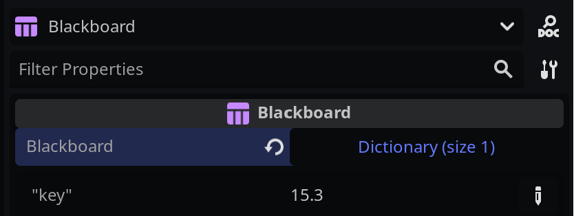

# Blackboard

The `Blackboard` is a useful object in Behavior Trees, designed to store and share data between multiple nodes. It enables efficient communication and data access among nodes, ensuring consistent behavior across your game characters or objects.

## Purpose of Blackboards

- **Centralized Data Management**: 
  - Blackboards act as a centralized repository for data in behaviour trees.
  - They offer an organized way to store and manage data, avoiding the complexity of passing variables directly to nodes.
  - This approach ensures that all nodes can access and modify the same set of data, maintaining consistency across the behavior tree.

- **Consistency and Synchronization**: 
  - Using a blackboard ensures that data remains consistent across all nodes.
  - It enables synchronized behaviors among different game characters or objects, as they all refer to the same data source.


## How does it work?

By default, every `BeehaveTree` manages its own instance of a blackboard. However, you can also create a new blackboard in your scene and reference it via the blackboard property on the Beehave tree. This approach allows you to share the same blackboard between multiple trees, promoting reusability and simplifying data management.

> **Global vs Local Scope in Blackboards**: 
>   - When a value is set on a shared blackboard, it becomes 'global' and affects all trees referencing that blackboard.
>  - However, using a custom blackboard name (as the 3rd argument in the key-value pair) allows for localizing the scope. This means changes to the blackboard will only affect the trees that use that specific custom name, enabling more controlled and isolated behaviors.

In order to set a value on a blackboard, call the `set_value` method:
```gdscript
func tick(actor:Actor, blackboard:Blackboard) -> int:

   # sets the value to '15.0' for "key" on the default blackboard
   blackboard.set_value("key", 15.0)

   # sets the value to '20.0' for "key" on the "custom" blackboard
   # note, that this does NOT override the previous value.
   # Both co-exist in different blackboards.
   blackboard.set_value("key", 20.0, "custom")

   return SUCCESS
```
Sometimes, we want to initiate a blackboard with values from the get-go. Currently, there are various ways to do this:

### 1. Custom Blackboard

```gdscript
class_name CustomBlackboard extends Blackboard

func _ready() -> void:
   set_value("key", 15.0)
```

### 2. Shared Blackboard

Set up a blackboard node in your scene tree and inject it into your scene script. Ensure to also assign the blackboard to your tree

```gdscript
# my_scene.ts
class_name MyScene extends Node2D

@onready var blackboard := $Blackboard

func _ready() -> void:
   blackboard.set_value("key", 15.0)
```

### 3. Editor properties

Another option is to set values in the node properties when selecting a `Blackboard` node in your scene tree:



## Examples
Here are some example scenarios to help you understand the Blackboard better:

### Example 1: Health Management
Imagine you have multiple characters in your game that need to monitor and share their health status. You can use a shared blackboard to store and access health data:

1. Create a shared blackboard instance in your scene
2. Reference the shared blackboard in the Beehave trees of each character
3. Use the blackboard to read and update health values for each character, allowing for synchronized behaviors

### Example 2: Quest Progress Tracking
In another example, you have a quest system that involves multiple characters and objects. You can use a shared blackboard to track the progress of the quest:

1. Create a shared blackboard instance in your scene
2. Reference the shared blackboard in the Beehave trees of each character and object involved in the quest
3. Use the blackboard to read and update quest progress, ensuring that all elements of the quest remain in sync

By leveraging the Blackboard in your Behavior Trees, you can create more complex and interconnected behaviors for your game characters and objects, while maintaining a clean and organized data structure.
