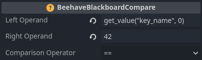
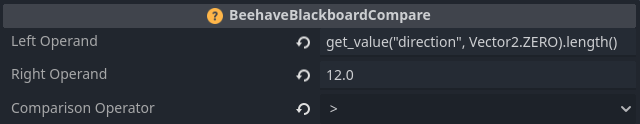

# Condition Leaf

The Condition Leaf is a specialized node in a behavior tree that evaluates specific conditions, such as *health_above_50* or *is_alive*. It plays a crucial role in the decision-making process based on the outcome of the condition evaluation.

## Usage

A `ConditionLeaf` node is employed to facilitate decision-making behaviors within a behavior tree. It assesses a user-defined condition and returns a status based on the evaluation outcome. If the condition is `true`, the `ConditionLeaf` returns a `SUCCESS` status. Conversely, if the condition is `false`, the `ConditionLeaf` returns a `FAILURE` status. The Condition Leaf is versatile and can be utilized to evaluate a wide array of conditions, including the proximity of an enemy, the availability of a particular item, or the health of the player character.

## Return Type

The `ConditionLeaf` returns a status code that indicates whether the condition is `true` or `false`. The status can be one of the following values:

Value | Description 
-- | -- 
`SUCCESS` | Indicates that the condition is true
`FAILURE` | Indicates that the condition is false

## Example

Below is an example demonstrating how a `ConditionLeaf` might be used to determine if the player character is within the attack range of an enemy:

```gdscript
class_name IsPlayerWithinAttackRange extends ConditionLeaf

func tick(actor: Node, _blackboard: Blackboard) -> int:
	var distance_from_player = actor.get_distance_from_player()
	var enemy_attack_range = actor.get_attack_range()

	if distance_from_player <= enemy_attack_range:
		return SUCCESS
	else:
		return FAILURE
```
In this example, we have extended the `ConditionLeaf` to create `IsPlayerWithinAttackRange`. This condition could be a part of a behavior tree used by an enemy, with the `Node` referenced by the `actor` parameter representing the enemy. Our enemy node provides access to a `get_distance_from_player` and a `get_attack_range` function, which are used to determine if the player is within attack range. If `distance_from_player` is less than or equal to `enemy_attack_range`, we return `SUCCESS`, and the behavior tree proceeds to execute an attack sequence. If `distance_from_player` is greater than `enemy_attack_range`, we return `FAILURE`, and the attack sequence is not executed.

## Blackboard Condition Nodes
Beehave provides some nodes for common and useful Blackboard condition checks.

### Blackboard Compare
The `BeehaveBlackboardCompare` node compares two values using a variety of comparison operators.

Here's how the node can be used to check if a blackboard key is equal to a certain value:


Since both operands are expressions, you can also do more advanced comparisons, like checking whether a direction vector exceeds a given length:


### Blackboard Has
The `BeehaveBlackboardHas` node returns `SUCCESS` is the blackboard has the specified key and `FAILURE` if it doesn't.