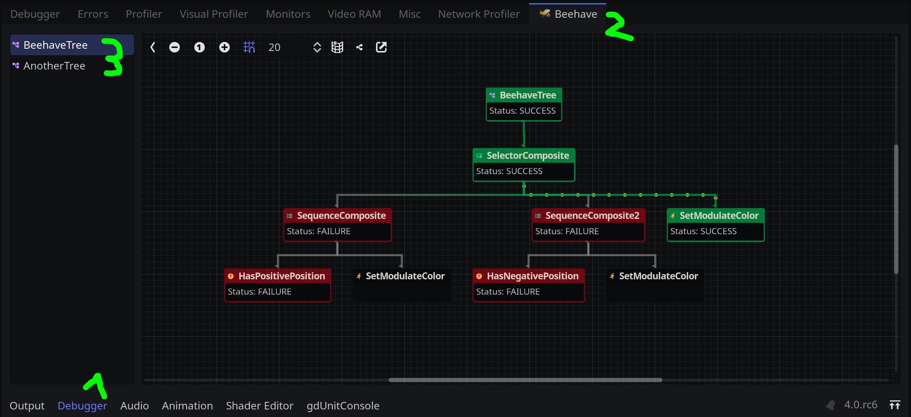
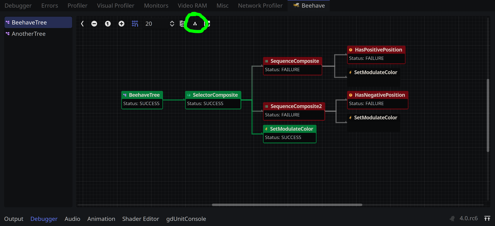
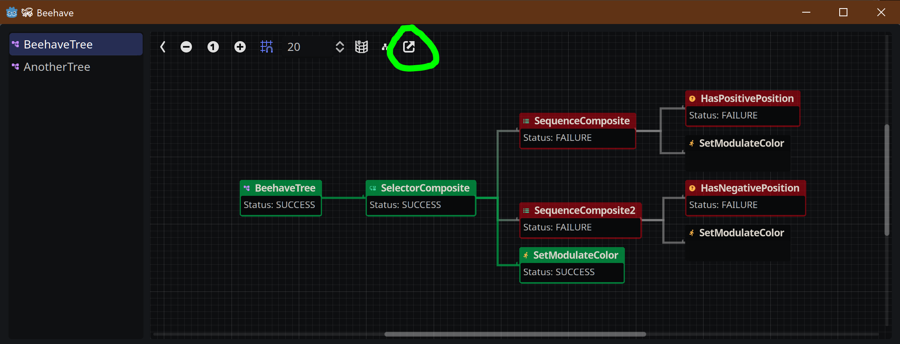

# Debugging

Debugging behavior trees can be challenging, especially when the AI behavior is complex. **Beehave** offers a debug view that allows you to investigate your behaviors at runtime. You can access it by clicking on the **Debugger** at the bottom of the editor. Navigate to the **🐝 Beehave** tab and click on any behavior tree of your choice.

> 💡 Please note that your game must be running, and your scene must contain a valid behavior tree for the behavior tree to show up.

The debug view provides real-time information about the state of each node in the tree, as well as the overall status of the tree. This can be useful for identifying issues with your behavior tree logic or tracking down errors that may be causing unexpected behavior in your game.

You can toggle between **vertical** and **horizontal** mode by clicking the button at the top of the debug view:

In case you want to investigate your behaviors in a separate window, **Beehave** allows you to pop out your debug view into a new window:

If you have any other ideas on how to improve the debug view, please feel free [to provide your feedback here](https://github.com/bitbrain/beehave/discussions/141).
