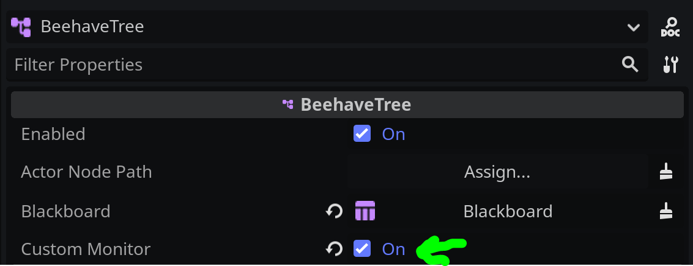

# Performance

To monitor the performance of **Beehave**, navigate to the **Debugger** at the bottom of the Godot editor and head to the **Monitors** tab. Then scroll down to the `beehave` section to view your monitors:

The following metrics are available:

| Metric Name | Description |
|---|---|
| `beehave/tree_id-process_time` | The total process time per frame tick for the whole behavior tree. |
| `beehave/total_trees` | The total number of **Beehave** nodes in the scene. |
| `beehave/total_enabled_trees` | The number of active behavior trees in the scene. |

## Enable Monitoring of Individual Trees

If your scene has potentially hundreds of behavior trees, it can quickly overload the Godot monitoring. Therefore, you need to toggle the custom monitor on the behavior tree of your choice to see the tree inside the Monitors section:

