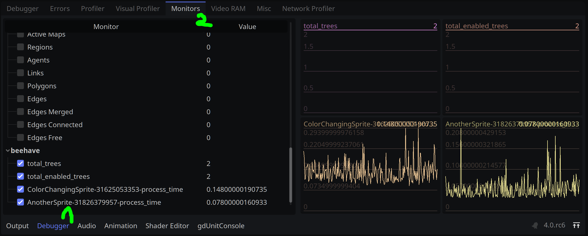

# Performance

You can monitor the performance of **Beehave** by navigating to your **Debugger** at the bottom of the Godot editor and head to the **Monitors** tab. Then, scroll down to the `beehave` section to view your monitors:

| Metric Name | Description |
|---|---|
| `beehave/tree_id-process_time` | The total process time per frame tick for the whole behaviour tree. |
| `beehave/total_trees` | The number of total beehave nodes in the scene. |
| `beehave/total_enabled_trees` | Number of active behaviour trees in the scene. |